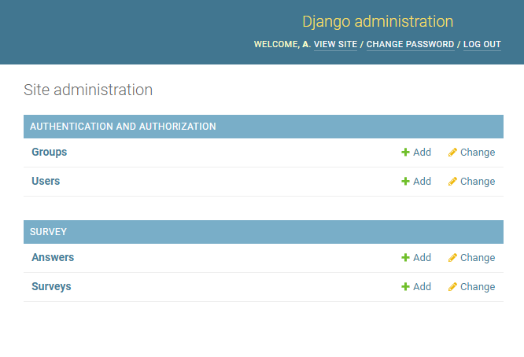
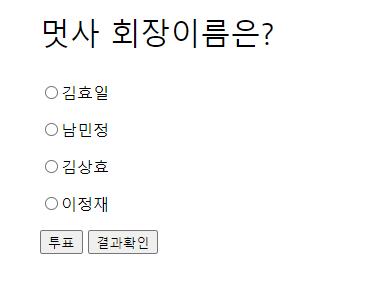
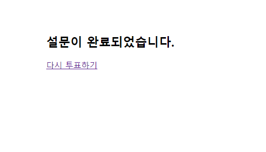
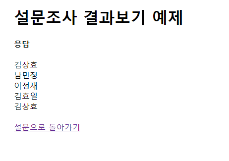

# 장고 자기소개 사이트 만들기

## 목표
자기소개 퀴즈 간단하게 만들어보기

## 요구사항
- survey 내용은 admin에서 작성합니다 (python manage.py createsuperuser를 통해서 superuser를 만든 뒤, 127.0.0.1/admin에 들어가 survey를 작성합니다.)
 
- answer를 form을 통해서 받은 뒤, 결과화면이 나오도록 구성합니다.
- 결과 화면에서는 답안을 전체적으로 보여줍니다.

### 프로그램 예시 이미지

 해당 예제 코드는 survey 파일 내에 있습니다! 다만, 확인하지 않고 스스로 풀어보시는 것을 추천드립니다. 
 (온라인으로 진행되기 때문에 기본적으로 코드를 공개합니다.)

### 제출 방법
- 각자 자기소개 퀴즈를 만들어본 다음, 서로 번갈아서 문제를 풀어보세요! (스터디원에 대해 얼마나 알고있는지 확인할 수 있는 기회!)
- 코드는 스터디 팀별 레포지터리의 week2 폴더에 제출해주세요.
- ex) week2/남민정/survey