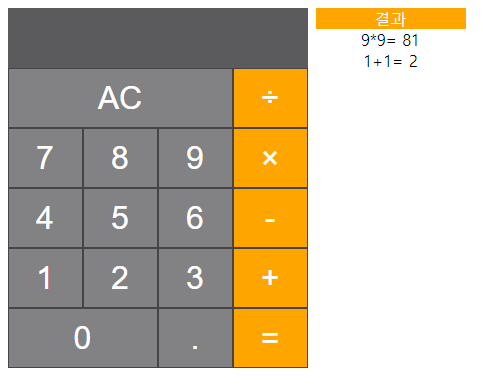

# 6주차 실습

## 목표
React로 계산기 만들기

## 요구사항
- 5주차에 사용한 틀을 그대로 사용합니다.

CSS 활용 (5주차와 동일해도 좋고, 아니어도 좋습니다) 
- CSS 레이아웃 - 가운데정렬 , 버튼 크기, 버튼 가로 비율  
- CSS 색,효과 - 배경색,글자색,글자크기, 결과창 오른쪽 정렬 커서가 버튼에 올라가면 투명도 변경 
- (Input 배경색 #5B5B5D Button 배경 #828284 Button 테두리 #454448 기호 Button 배경 orange 글자색 white)

React 활용 
- state 기능을 활용합니다. (잘 모르시겠다면 React JS 영화 웹서비스 만들기 강의 #3 state를 참고해주세요!)
- 숫자, 기호버튼을 누르면 디스플레이에 텍스트 추가
- AC버튼을 누르면 디스플레이 초기화
- = 버튼을 누르면 결과값이 나오며, 우측의 결과 내용에 추가되도록 

혹시 기본 계산기를 전부 완성하셨다면, 다른 기능이 추가된 계산기들을 추가적으로 만들어보셔도 좋습니다:)

## 점수 부여 방식
- HTML & CSS 레이아웃 - 1점
- CSS 글자크기, hover 효과 구현 - 1점
- React add function - 1점
- React Reset,Calculate Function = 1점
- React 결과 리스트 생성 = 1점

## 완성 예시 이미지 
